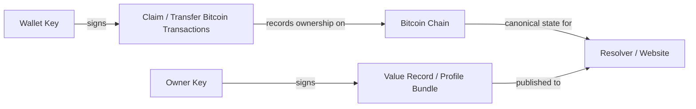

# Global Name System (GNS)

Global Name System is a human-readable naming layer anchored to Bitcoin.

The best front door is narrower than “DNS replacement.” GNS is easiest to understand as **payments first, counterparties second, broader publishing and service uses later**: a way to say who gets paid, which merchant you trust, or which counterparty or service you mean without depending on a registrar, a platform handle, or a rented suffix.

The hosted website is mainly a tool surface:

- browse names
- check availability
- prepare claims
- prepare offline and batched ordinary-lane claim artifacts
- prepare transfers
- fund the private signet demo

This repository is where the fuller project explanation lives.

Human-facing amounts in GNS use integer bitcoin notation alongside the conventional BTC equivalent. Example: `₿50,000 (0.0005 BTC)`.

## Start Here

If you want the shortest honest project orientation before touching the product surface, start with:

1. [docs/core/GNS_FROM_ZERO.md](./docs/core/GNS_FROM_ZERO.md)
2. [docs/research/GNS_IMPLEMENTATION_AND_VALIDATION.md](./docs/research/GNS_IMPLEMENTATION_AND_VALIDATION.md)
3. [docs/research/MERKLE_BATCHING_STATUS.md](./docs/research/MERKLE_BATCHING_STATUS.md)
4. [docs/research/LAUNCH_SPEC_V0.md](./docs/research/LAUNCH_SPEC_V0.md)
5. [docs/core/TESTING.md](./docs/core/TESTING.md)

If you want the fastest first walkthrough, use the hosted private demo:

1. Open [setup](https://globalnamesystem.org/setup) and point Sparrow at the hosted demo wallet endpoint shown there.
2. Request demo coins into the same Sparrow wallet you plan to spend from.
3. Open [claim prep](https://globalnamesystem.org/claim), choose the name, and save the owner key + backup package.
4. Build the commit and reveal PSBTs, sign them in Sparrow, and watch the name appear in [explore](https://globalnamesystem.org/explore).

If you want the tightest possible product demo instead of the full docs path, use:

- [docs/demo/FLINT_DEMO.md](./docs/demo/FLINT_DEMO.md)

Keep these distinctions in mind:

- the **wallet key** signs Bitcoin transactions
- the **owner key** controls the name later for value updates and transfers
- the hosted site prepares the flow, but your wallet still signs and broadcasts it
- in v1, losing the **owner key** means losing update and transfer authority for that name

One important testing/status distinction:

- the hosted private demo is a **private signet** walkthrough and the active live environment we maintain
- explicit ordinary-lane Merkle batching is implemented and validated in fixture mode, controlled-chain regtest, and the hosted **private signet** batch smoke flow
- the old shared **public signet** path has been retired from the active demo and validation story because faucet funding never became reliable

## Quick Map



GNS has two different authority layers:

- the **wallet key** signs Bitcoin transactions that establish or transfer ownership
- the **owner key** signs the off-chain value record that says what the name points to

## Pick The Path That Fits

There are three practical ways to use GNS today:

| Path | Best for | What you trust | Works today |
| --- | --- | --- | --- |
| `Hosted Private Demo` | Fastest first walkthrough | Hosted site, hosted resolver, private demo chain | Yes |
| `Self-Hosted Website + Resolver` | Running your own browsing and resolution surface | Your own web stack and resolver; optionally your own Bitcoin backend | Yes |
| `Offline / Higher-Trust Claim Prep` | Preparing claims without depending on the hosted site UI | Local browser bundle plus your own signer | Yes |

Hosted private demo:
- website: [https://globalnamesystem.org](https://globalnamesystem.org)
- setup: [https://globalnamesystem.org/setup](https://globalnamesystem.org/setup)
- claim prep: [https://globalnamesystem.org/claim](https://globalnamesystem.org/claim)
- experimental auction lab + chain-derived bid feed: [https://globalnamesystem.org/auctions](https://globalnamesystem.org/auctions)

Self-hosted website + resolver:
- quick guide: [SELF_HOSTING.md](./docs/core/SELF_HOSTING.md)

Offline / higher-trust claim prep:
- offline architect: [https://globalnamesystem.org/claim/offline](https://globalnamesystem.org/claim/offline)

## What Works Today

| Capability | Status | Notes |
| --- | --- | --- |
| Hosted private demo claims | Yes | Best first walkthrough today |
| Self-hosted website + resolver | Yes | Fixture-backed by default; can point at your own backend later |
| Browser value publishing | Yes | Owner-signed in the browser |
| Profile bundle value records | Yes | One record can point to several destinations |
| Transfers | Prototype | Works in the prototype, but not yet mainnet-ready |
| Mainnet-ready usage | Not yet | Still an active prototype |

## Which Key Does What

| Key | What it controls | Used for | If lost |
| --- | --- | --- | --- |
| `Wallet key` | Bitcoin UTXOs | Signing claim and transfer transactions | You lose control of the bitcoin and cannot complete those transactions |
| `Owner key` | Name authority after claim | Signing value updates and authorizing transfers | In v1, you lose update and transfer authority for that name |

## Claim Lifecycle At A Glance

| Phase | What it means | What you do next |
| --- | --- | --- |
| `Prepare` | Pick the name, create or paste the owner key, and build the claim plan | Save the owner key and backup package |
| `Commit Broadcast` | The hidden claim transaction is on-chain | Wait for confirmation |
| `Reveal Broadcast` | The name is published within the reveal window and becomes claimed | Watch the name move into settlement |
| `Settling` | The name is already owned and usable, but bond continuity still matters | Keep the bond intact until maturity |
| `Active` | The name is mature, so ongoing bond continuity no longer matters | Publish values, update the key/value bundle, or transfer later |
| `Released` | The name returned to the pool | Start a fresh claim if you still want it |

## Hosted Demo Walkthrough

If you are brand new, this is the shortest path through the hosted product.

For the shortest presenter-friendly version, use [docs/demo/FLINT_DEMO.md](./docs/demo/FLINT_DEMO.md).

### 1. Start at the homepage

Use the homepage to look up a name, see the quick model, and choose whether you want `Setup`, `Claim`, or `Explore`.


### 2. Set up Sparrow and request demo coins

Use the setup page to point Sparrow at the hosted private signet wallet endpoint, confirm it sees the demo chain, then fund the same wallet you plan to spend from.


### 3. Prepare the claim

On claim prep, pick the name, generate or paste the owner key, save the backup package, and build the commit/reveal signer handoff.


### 4. Publish what the name points to

Once the name is active, use the values tool to publish ordered key/value pairs that describe where the name should resolve.


### 5. Inspect the live prototype status

Use the explore page to inspect recent names, provenance, and the current smoke summaries. On the hosted private signet demo, the explorer now also surfaces the latest batched ordinary-claim smoke run so you can see a real batch anchor, later reveals, and a post-claim transfer check.

Use the auction page to inspect both:

- the current reserved-auction simulator states directly in the website
- and the newer chain-derived experimental `AUCTION_BID` feed for catalog lots,
  including stale-bid rejection, same-bidder replacement, and derived
  bond spend / release summaries
- plus the hosted private signet auction-smoke summary showing a real opening
  bid, higher bid, settlement into a live owned name, winner value publishing,
  post-release transfer, and an intentionally early losing-bond spend on a
  dedicated smoke lot

## What GNS Is

GNS names are first-class strings like `satoshi`, not hierarchical domains like `satoshi.com`.

Ownership is derived from Bitcoin transactions. Mutable value records stay off-chain and are signed by the current owner key. That means GNS uses Bitcoin as a notary for ownership and state transitions, not as a general-purpose database.

The result is a naming layer that can point to:

- payment endpoints
- identities and profiles
- APIs and services
- software or agent endpoints
- whatever other owner-signed resources the ecosystem chooses to support

## Why It Exists

Most names on the internet are controlled by someone other than the person using them.

- social handles can be suspended or reassigned by platforms
- DNS domains depend on registries, registrars, DNS hosts, CDNs, billing, and account security
- human-readable payment or identity aliases usually inherit one of those stacks underneath

GNS is trying to offer a different model:

- no suffixes
- no registrar
- no annual renewal rent
- no protocol operator selling the namespace
- publicly verifiable ownership history

So the right framing is not just “better DNS.” It is closer to a sovereign naming layer for the internet resources humans want to access and remember.

The clearest current wording is:

> use a human-readable name to say who gets paid or which counterparty or service you trust.

Adjacent work is worth keeping in mind here too. Systems like Pubky / PKARR (which the old Slashtags project now points to) explore self-sovereign routing around public keys and signed DHT records while intentionally avoiding a scarce global human-readable namespace. GNS is trying to solve a different layer: Bitcoin-anchored ownership of shared human-readable names for payments first, then broader counterparties and services after that. For a short internal comparison note, see [docs/research/GNS_VS_PUBKY_PKARR.md](./docs/research/GNS_VS_PUBKY_PKARR.md).

## How Ownership Works

### Claims

Claims use a commit/reveal flow.

1. `COMMIT` hides the intended name while establishing the claim attempt.
2. `REVEAL` publishes the name within the allowed reveal window.
3. the name then enters a settlement period during which bond continuity matters

### Bonds

Claims are backed by locked bitcoin bonds, not fees paid to an issuer.

- shorter names require larger bonds
- longer names quickly fall toward a floor
- the bond is not paid to GNS
- the claimer keeps the bitcoin and only gives up liquidity for the settlement period

### Transfers

Transfers move owner authority from one pubkey to another.

- settling names still require successor-bond continuity
- active names no longer require that continuity
- the owner key, not a resolver, is what authorizes future value updates
- after a transfer, the old owner can no longer publish new value records for that name
- if the owner key is lost, v1 has no built-in protocol recovery path even if the user still controls the wallet that funded the claim

### Values

What a name points to is intentionally off-chain.

- values are signed by the current owner
- authenticity is cryptographic
- availability depends on one or more resolvers retaining a copy

## Bonding And Namespace Allocation

GNS tries to make namespace allocation as neutral as possible.

It does that by using locked bitcoin bonds instead of:

- registrar pricing tiers
- recurring rent
- founder allocation
- whitelist access
- protocol-level sales of names

For ordinary names, the current lead launch direction still uses a public objective curve. For salient existing names, the current lead launch direction is a separate deferred reserved lane with public auctions instead of hand-priced protocol sales.

### Bond Curve

The current launch curve is:

- `₿100,000,000 (1 BTC)` for a 1-character name
- each additional character halves the required bond
- the bond floors at `₿50,000 (0.0005 BTC)` for names of length 12 and longer

That makes short names economically expensive to corner while keeping the long tail accessible.

### Why The Namespace Remains Open

Using the current v1 alphabet (`a-z0-9`), there are about `2.18 billion` possible 6-character names.

At the current 6-character bond of `₿3,125,000 (0.03125 BTC)`, claiming all possible 6-character names would require about `68 million BTC`, which is more than three times Bitcoin’s total `21 million` supply.

Even if every bitcoin in existence were somehow devoted to 6-character claims, it would only be enough to bond about `672 million` names out of roughly `2.18 billion` possible 6-character names. The majority of that namespace would still remain open.

That does not make allocation perfectly neutral. Early participants, wealthy claimants, and fee conditions will matter. But under the current v1 alphabet and bond curve, it does mean that from 6-character names onward, fully cornering the namespace becomes economically impossible: combinatorial supply outgrows the total capital that can exist.

### Why The Bond Ends At Maturity

Mature names currently remain valid without ongoing bond continuity.

This is intentional. The fairness mechanism is the opportunity cost of locking capital through settlement, not perpetual rent. Once a claimer has committed bitcoin for the full maturity period, the protocol has already observed a meaningful economic signal that they value the name and gave up the chance to use that capital elsewhere. Requiring the bond to remain parked indefinitely would add ongoing carrying cost without materially improving initial allocation fairness, while also increasing permanent UTXO pressure.

## Blockspace Footprint

GNS keeps its pure naming payload small, but it still consumes real Bitcoin blockspace because each successful claim is a pair of ordinary Bitcoin transactions.

Current implementation summary:

- pure naming payload per completed claim: about `117–148 bytes`
- observed full claim footprint: about `404 vbytes`
- observed full serialized footprint: about `566 raw bytes`

So GNS is compact as protocol data, but it still competes in the normal fee market like any other transaction. The main brakes on overuse are:

- fee pressure
- bond capital lockup
- temporary UTXO pressure during settlement

## Resolver And Availability Model

GNS has two different availability stories:

### Ownership

Ownership is chain-derived.

- any operator with chain data can reconstruct the canonical name set
- a resolver does not get to invent ownership
- a resolver going offline does not destroy the registry

### Values

Value records are different.

- they are portable and owner-signed
- any compatible resolver can verify them
- but in v1 their availability is only as decentralized as the set of resolvers people actually publish to and query

That means v1 is decentralized for ownership, but still only partly decentralized for value availability. The most likely next step is client-side multi-resolver publish, not mandatory resolver gossip as the first move.

## Hosted Product

The current hosted product is here:

- Home / lookup: [https://globalnamesystem.org](https://globalnamesystem.org)
- Explore: [https://globalnamesystem.org/explore](https://globalnamesystem.org/explore)
- Claim prep: [https://globalnamesystem.org/claim](https://globalnamesystem.org/claim)
- Transfer prep: [https://globalnamesystem.org/transfer](https://globalnamesystem.org/transfer)
- Setup: [https://globalnamesystem.org/setup](https://globalnamesystem.org/setup)
- Offline claim architect: [https://globalnamesystem.org/claim/offline](https://globalnamesystem.org/claim/offline)

The website is intentionally becoming more tool-oriented over time. The deeper explanation, economics, and design rationale are expected to live here in the repo.

## Current Demo Wallet Support

For the hosted private signet demo today:

- `Sparrow`: supported path
- `Electrum`: not for this hosted private demo; the official app disconnects because the demo chain sits below Electrum's built-in public signet checkpoint height
- `Other PSBT wallets`: more plausible now that the wallet endpoint is public, but still not yet validated end to end

Why:

- the hosted private demo now exposes a public wallet endpoint that Sparrow can use directly
- Bitcoin Core RPC stays private on the server
- Sparrow is the first wallet path we support end to end on top of that endpoint
- official Electrum still rejects this small private signet because it expects the shared public signet checkpoint height
- broader wallet support should still get easier from here, but not every signet wallet will accept a low-height private chain

If you want to reset the hosted private demo to the canonical example set, run:

```bash
npm run reseed:private-signet:canonical -- root@<server-ip> ~/.ssh/<your-key>
```

## Quick Start

### Run the local prototype

```bash
npm install
npm run dev:all
```

Then open:

- `http://127.0.0.1:3000`

### Run your own web + resolver stack

```bash
cp .env.example .env
npm run selfhost:doctor
npm run selfhost:up
```

Then open:

- `http://127.0.0.1:3000`

That default path runs against the bundled fixture chain so you can use your own site and resolver immediately. If the doctor step says Docker is missing, install Docker Desktop or Docker Engine first. To point the stack at your own Bitcoin backend later, use [SELF_HOSTING.md](./docs/core/SELF_HOSTING.md).

### Run the controlled-chain suite

```bash
npm run test:regtest-cli-suite
```

### Private signet demo with Sparrow

- guide: [SPARROW_PRIVATE_SIGNET.md](./docs/demo/SPARROW_PRIVATE_SIGNET.md)
- one-command session helper: `/path/to/gns/scripts/start-private-signet-sparrow-session.sh`
- official Sparrow download: [https://sparrowwallet.com/download/](https://sparrowwallet.com/download/)

## Repository Map

This is a TypeScript monorepo using `npm` workspaces.

### Product surfaces

- `apps/web`: hosted site, explorer, claim prep, transfer prep, setup, offline architect bundle
- `apps/cli`: claim, transfer, value-record, and operator tooling

### Chain and resolution services

- `apps/resolver`: read API, value-record API, provenance endpoints, recent activity
- `apps/indexer`: long-running and one-shot chain indexing entrypoint

### Shared libraries

- `packages/protocol`: wire format, constants, signatures, value records, transfer packages
- `packages/bitcoin`: Bitcoin RPC parsing and chain-source helpers
- `packages/core`: state machine, indexing logic, snapshots, activity tracking
- `packages/db`: snapshot and value-record persistence adapters
- `packages/architect`: pure transaction-prep and PSBT-building logic shared by web and CLI

### Scripts

- `scripts/bootstrap-*.sh`: VPS bootstrap and domain setup
- `scripts/deploy-*.sh`: VPS deploy flows
- `scripts/*sparrow*`: local Sparrow + private signet helpers
- `scripts/*demo*` and `scripts/*suite*`: smoke, demo, and regtest integration flows

## Documentation

Start here:

- [docs/core/GNS_ONE_PAGER.md](./docs/core/GNS_ONE_PAGER.md): short overview of the design, economics, and blockspace footprint
- [docs/README.md](./docs/README.md): documentation index
- [docs/core/SELF_HOSTING.md](./docs/core/SELF_HOSTING.md): run your own website + resolver stack
- [docs/core/ARCHITECTURE.md](./docs/core/ARCHITECTURE.md): system structure, trust boundaries, and runtime modes
- [docs/core/DECISIONS.md](./docs/core/DECISIONS.md): design decisions and open tradeoffs
- [docs/core/TESTING.md](./docs/core/TESTING.md): fixture, regtest, public signet, and private signet testing paths
- [docs/research/TRANSFER_RELAY_OPTIONS.md](./docs/research/TRANSFER_RELAY_OPTIONS.md): why transfers are still policy-sensitive and what the real redesign options are
- [CONTRIBUTING.md](./CONTRIBUTING.md): local setup and contribution workflow

More exploratory and draft-oriented material lives under [`docs/research/`](./docs/research/).

## Status

GNS is currently in active prototype phase.

It is useful for local, regtest, signet, and private-signet experimentation, but it is **not ready for mainnet use**.

Important known issues and tradeoffs include:

- the current transfer payload shape exceeds older conservative `OP_RETURN` relay limits, so relay compatibility still depends on node policy even though modern Bitcoin Core defaults are more permissive
- mature-name permanence makes long-name holding cheap after settlement
- value-record availability can still concentrate around a small number of resolvers in v1

## License

This repository is licensed under the [MIT License](./LICENSE).
