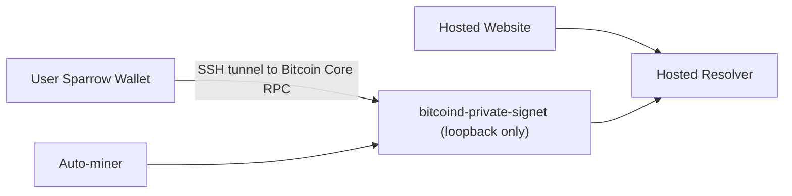
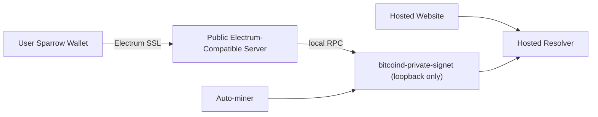

# Hands-Off Hosted Demo Wallet Plan

This note turns the current wallet limitation into a concrete implementation target.

## Goal

Let a new person discover the hosted private-signet demo, connect a wallet, request demo coins, and complete a claim **without needing SSH access from the operator**.

The current hosted flow does not meet that bar. It works, but it still depends on:

- a local SSH key
- a granted `user@host`
- a tunnel from the user's machine to the demo VPS

That is good enough for internal testing. It is not good enough for a public, hands-off demo.

## Current Architecture

Today the private demo looks like this:

Important properties of the current setup:

- the private signet `bitcoind` RPC stays private on loopback
- Sparrow talks to Bitcoin Core directly
- the helper scripts fetch live RPC credentials over SSH
- every external tester needs active operator coordination

## Recommended Target

The smallest credible way to remove SSH from the user path is:

1. keep `bitcoind-private-signet` private on loopback
2. add a **public Electrum-compatible server** on the same VPS
3. have Sparrow connect to that Electrum endpoint directly
4. keep funding and automatic mining exactly as they work today

That changes the shape to:

## Why This Is The Right Direction

This keeps the current trust and safety boundaries mostly intact:

- Bitcoin Core RPC stays private
- users do not get shell access to the VPS
- users do not need per-person SSH keys
- the wallet connection path starts to look like a normal wallet experience

It also unlocks two useful things at once:

- Sparrow can connect without operator intervention
- Electrum itself becomes much more realistic to support later

## Why Not Expose Bitcoin Core RPC Directly

That would be the wrong public surface.

Even with authentication, exposing Bitcoin Core RPC to the internet is much more sensitive than exposing a wallet-facing Electrum endpoint. The hosted demo should separate:

- public wallet access
- private node administration

Electrum-compatible read access is a much better fit for a public demo.

## Recommended First Implementation

Use an **Electrum-compatible server such as `electrs`** on the VPS as the first implementation.

Why this is the best first move:

- it fits the current `bitcoind`-plus-systemd deployment model
- Sparrow already understands Electrum cleanly
- it is a smaller operational change than replacing the rest of the demo stack

If scale or operational behavior later makes `electrs` a poor fit, we can revisit that choice. For the first hands-off demo, the important thing is the interface, not the brand of Electrum server.

## Minimal Implementation Plan

### Phase 1: Add The Public Wallet Surface

Add one new service role to the private demo VPS:

- `ont-private-electrum` or `electrs-private-signet`

It should:

- talk to `bitcoind-private-signet` over loopback RPC
- expose an Electrum-compatible public endpoint
- use TLS for wallet connections

New public surface:

- a dedicated host or port for the private demo wallet endpoint
- example shape:
  - `signet-wallet.opennametags.org:50002`
  - or `<server-ip>:50002` as an earlier milestone

### Phase 2: Update The User Path

Replace the SSH-based helper in the public newcomer path with:

- direct Sparrow Electrum settings
- optionally a tiny config helper that writes Sparrow's signet profile for Electrum instead of Bitcoin Core

The setup page should then become:

1. open Sparrow in signet mode
2. choose Electrum
3. enter the public demo endpoint
4. request demo coins
5. continue to claim

### Phase 3: Keep SSH For Operators Only

After the public Electrum path is stable:

- keep the SSH helper scripts, but reframe them as operator/internal tools
- remove SSH from the main hosted walkthrough
- keep self-hosting and offline prep as the stronger-trust alternatives

## Exact Components To Add

For the current VPS layout, the minimum set is:

- one Electrum-compatible service process
- one systemd unit for that service
- one TLS strategy for the wallet endpoint
- one firewall rule for the public wallet port
- one health check or smoke test that verifies Sparrow-visible connectivity

The existing pieces can stay:

- `bitcoind-private-signet`
- `ont-private-resolver`
- `ont-private-web`
- the private demo funding helper
- the private demo auto-miner

## Docs And Product Changes Needed

Even before this is implemented, the repo and website should stay explicit:

- today's hosted wallet setup still requires granted SSH access
- that is a temporary demo limitation, not the intended long-term path
- the hands-off demo path means a public Electrum-compatible server

Once implemented, update:

- `README.md`
- `docs/demo/SPARROW_PRIVATE_SIGNET.md`
- the `/setup` page
- wallet compatibility FAQ copy

## Suggested Rollout Order

1. add the Electrum-compatible server privately on the VPS
2. verify Sparrow can connect without SSH
3. keep the SSH helper path working in parallel for a short transition
4. switch the public setup page to the Electrum path
5. validate with one or two fresh external testers

## Success Criteria

We should call this done only when a new tester can:

1. open the hosted setup page
2. connect Sparrow without SSH or operator-provided shell access
3. request demo coins
4. sign and broadcast the auction bid flow
5. see the demo confirm automatically

At that point the hosted demo becomes meaningfully closer to a real stranger-safe walkthrough.
